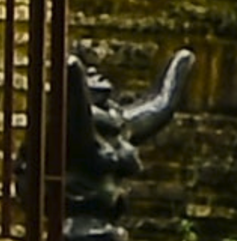
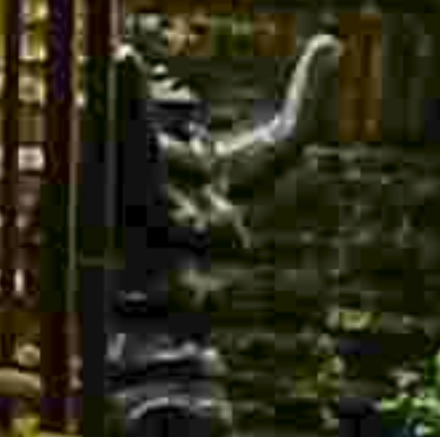
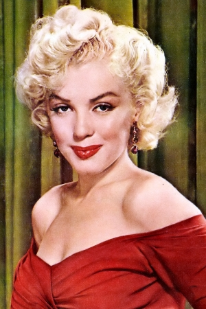
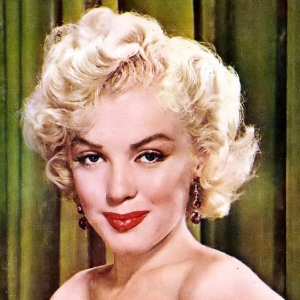
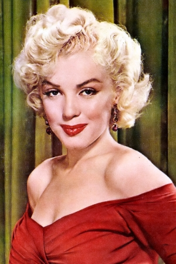
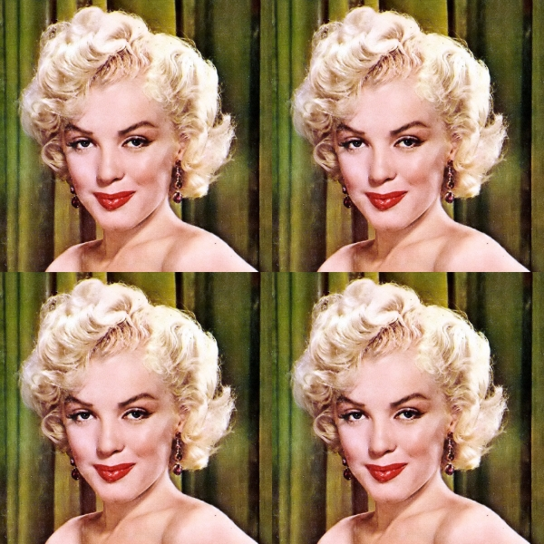
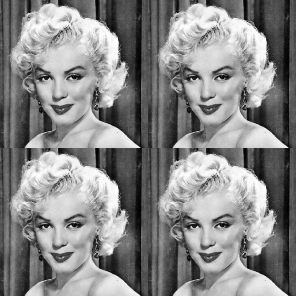

# ImageMagick


https://imagemagick.org | https://github.com/imagemagick/imagemagick

---

# About

> ImageMagick is a free and open-source software suite for displaying,
  creating, converting, modifying, and editing raster images. It can read and
  write over 200 image file formats.

https://en.wikipedia.org/wiki/ImageMagick

---

# History

> ImageMagick was created in 1987 by John Cristy when working at DuPont, to
convert 24-bit images (16 million colors) to 8-bit images (256 colors), so they
could be displayed on most screens. It was freely released in 1990 when DuPont
agreed to transfer copyright to ImageMagick Studio LLC, still currently the
project maintainer organization.

https://en.wikipedia.org/wiki/ImageMagick#History

---

# Features and Capabilities

   * [File format conversion](https://imagemagick.org/script/convert.php)
   * [Animation](https://imagemagick.org/Usage/anim_basics/)
   * [Color management](https://imagemagick.org/script/color-management.php)
   * [Command-line processing](https://imagemagick.org/script/command-line-processing.php)
   * [Montage](https://imagemagick.org/script/montage.php)
   * [Special effects](https://imagemagick.org/Usage/blur/)
   * [Text & comments](https://imagemagick.org/Usage/text/)
   * and much more...

---

# Commands


---

# Identify

```
% identify [-verbose] MM.jpg 
MM.jpg JPEG 300x450 300x450+0+0 8-bit sRGB 129840B 0.000u 0:00.000
```
https://imagemagick.org/script/identify.php

---

# Compress

```
convert original.jpg -quality 10 compressed.jpg
```

----

# Compress - comparison

 

---

# Crop

```
convert MM.jpg -gravity North -crop 200x200 +repage MM_square.jpg
```
https://imagemagick.org/Usage/crop/

----

## Crop - Before



----

## Crop - After



---

# Resize

```

convert MM.jpg -resize 50% MM_halfsize.jpg
convert MM.jpg -resize "400x" MM_400stupid.jpg
convert MM.jpg -resize "400x>" MM_400clever.jpg
identify MM_400clever.jpg 

> MM_600clever.jpg JPEG 300x450 300x450+0+0 8-bit sRGB 120472B 0.000u 0:00.000

```

https://imagemagick.org/Usage/resize/

----

## Resize - After

halfsize / stupid / clever




--- 

# Montage

```
convert MM_square.jpg -clone 0 -clone 0  \( -clone 0 -channel RGB -negate \) \ 
  miff:- | montage - -geometry +0+0 MM_multiple.jpg
```

https://imagemagick.org/Usage/montage/

----

## Montage - After



---

# Black and white

```
convert MM_square.jpg -colorspace gray MM_square_gray.jpg
```
https://imagemagick.org/www/script/color-management.php

----

## Black and white - After



---

# Watermarking with `composite`

 + 

----

## Basic compositin (superposition)

```
composite -gravity south dojoman.png CB.jpg CB_com.jpg
```


---

## Watermarking with image

```
composite -watermark 30x100 -gravity south dojoman.png CB.jpg CB_com.jpg
composite -watermark 30x0 -gravity south dojoman.png CB.jpg CB_com.jpg
```


---

## Watermarking with text

```
convert -background transparent -fill "#ffffff"  \
        -font Helvetica -pointsize 240 label:"(C) EPFL-Dojo" miff:- \
    | composite -watermark 30x100 -gravity SouthEast - CB.jpg CB_wm3.jpg        

```


---

# Geometry: size
 - `scale% | scale-x%xscale-y%`: 	H and W scaled by specified percentage.
 - `width | xheight`: W or H given, keep AR
 - `widthxheight`: max W or H, keep AR
 - `widthxheight^`: min W or H, keep AR
 - `widthxheight!`: exact W and H, AR ignored
 - `widthxheight>`: shrink if larger.
 - `widthxheight<`: enlarge if smaller
 - `area@`: total number of pixels, keep AR

---

# Geometry: offset

`{size}{+-}x{+-}y`

 - Specifying the offset (default is `+0+0`). 
 - Affected by `-gravity`
 - Sign matters!

https://imagemagick.org/script/command-line-processing.php#geometry

---

# Regions

`-region geometry` can be used to change portion of the image:

```
convert MM.jpg -region 134x70+240+524 -modulate 100,100,50  MM_relip.jpg
```


---

options with `+` and `-` have differen mening. Example:
 
 - `-write` writes the image in the given format. The image will be available
   for further processing later in the pipe
 - `+write` writes the image in the given format but duplicate the original
   before so that the next processing in the pipe is done on an uncompressed
   image
 - `-append` attach image below
 - `+append` attach image on the right

---

## miff images

 - is the internal IM storage and can hold several images
 - is normally used to pass set of images between IM commands

---

## Commands

 * identify (`identify [-verbose] file.png` is equivalent to `convert [-verbose] file.png info:-`)
 * convert (magick)
 * compare
 * composite
 * mogrify
 * montage
 * display (X11 only)

---

```
% convert -list interpolate     
Average
Average4	
Average9
Average16
Background
Bilinear
Blend
Catrom
Integer
Mesh
Nearest
Spline
```

---

[FredsEffects]: http://www.fmwconcepts.com/imagemagick/index.php
[TheColorApi]: http://www.thecolorapi.com/docs
[colormindApi]: http://colormind.io/api-access/
[geometry]: https://imagemagick.org/script/command-line-processing.php#geometry


[clut]: http://www.imagemagick.org/script/command-line-options.php#clut
[interpolate]: http://www.imagemagick.org/script/command-line-options.php#interpolate
[tutorial1]: https://www.ibm.com/developerworks/library/l-graf/?ca=dnt-428